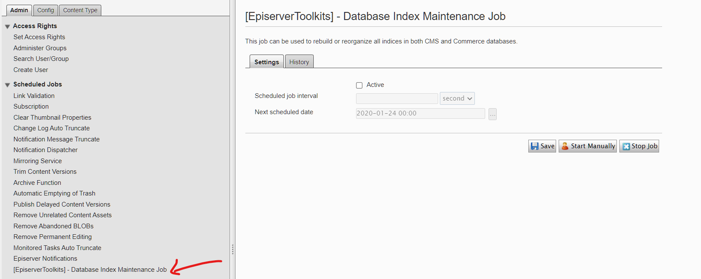
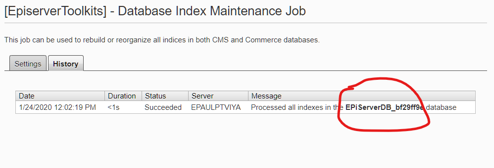

# EpiserverToolKits.DatabaseMaintenanceJob

[](https://www.nuget.org/packages/DatabaseMaintenanceJob/)[](https://www.nuget.org/packages/EpiserverToolKits.DatabaseMaintenanceJob/)

[](https://ci.appveyor.com/project/javafun/episervertoolkits)

[](https://sonarcloud.io/dashboard?id=javafun_EpiserverToolKits)


## NuGet

```
PM> Install-Package DatabaseMaintenanceJob
```
## Why do I need another database maintenance job?
Apparently, Episerver only provides database index maintenance job when you have Commerce installed, there is no way to use the job only in CMS project. 


# How to use

Once the package has been installed to your site, you'll find `[EpiserverToolkits] Database Index Maintenance Job` at the bottom of Scheduled Jobs section.







## Configuration

You can control the index optimization threshold and databases you do not want to run index optimization with the following options in the web.config under `appsettings` section.

| Appsetting Name  | Description  |
|---|---|
| lowFragmentationThreshold  | Database re-organize index threshold. **Default value is 10** |
| highFragmentationThreshold | Database rebuild index threshold. **Default value is 30**   |
| excludedDatabases  | List of databases exclude from index re-organize / rebuild. By default the job will rebuild/re-organize all databases listed under connectionstrings section. |

## Test/ Build / Release

Clone the repository and build solution with `dotnet cli` 

Build in release mode:
```
dotnet build -c Release /p:Version=<version>
```

Create package
```
dotnet pack --no-build -c Release /p:PackageVersion=<version>
```

Run unit test

```
dotnet test
```

## License

The MIT License (MIT)

Copyright (c) 2020 Vincent Yang

Permission is hereby granted, free of charge, to any person obtaining a copy of this software and associated documentation files (the "Software"), to deal in the Software without restriction, including without limitation the rights to use, copy, modify, merge, publish, distribute, sublicense, and/or sell copies of the Software, and to permit persons to whom the Software is furnished to do so, subject to the following conditions:

The above copyright notice and this permission notice shall be included in all copies or substantial portions of the Software.

THE SOFTWARE IS PROVIDED "AS IS", WITHOUT WARRANTY OF ANY KIND, EXPRESS OR IMPLIED, INCLUDING BUT NOT LIMITED TO THE WARRANTIES OF MERCHANTABILITY, FITNESS FOR A PARTICULAR PURPOSE AND NONINFRINGEMENT. IN NO EVENT SHALL THE AUTHORS OR COPYRIGHT HOLDERS BE LIABLE FOR ANY CLAIM, DAMAGES OR OTHER LIABILITY, WHETHER IN AN ACTION OF CONTRACT, TORT OR OTHERWISE, ARISING FROM, OUT OF OR IN CONNECTION WITH THE SOFTWARE OR THE USE OR OTHER DEALINGS IN THE SOFTWARE.
